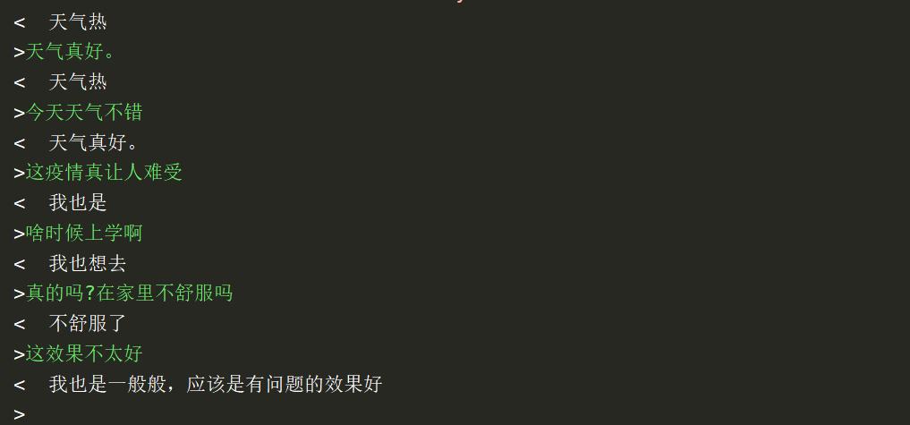

###  基于seq2seq，atttention ,greedy 技术使用tensorflow2.0构建的短文本闲聊机器人
### 数据集 new_corpus.txt 已处理 ，原始数据corpus.txt ，checkpoint文件见网盘：链接：https://pan.baidu.com/s/1TUYEzuXs3YRtyK2rLizBiA  提取码：lsrm 
复制这段内容后打开百度网盘手机App，操作更方便哦
+ 语料示例
    - start 机器人很蠢 end
    - start 我们不是超级智能。 end
    - start 机器人不允许撒谎 end
    - start 机器人有自己的自由意志,你知道。 end
    - start 什么操作系统 end
    - start 我的软件在所有操作系统上运行,包括Windows,Linux和Mac OS。 end
    - start 什么类型的电脑 end
    - start 任何支持Python的计算机。 end
### 训练10个epoch效果如下：

### 继续训练应该效果会有上升